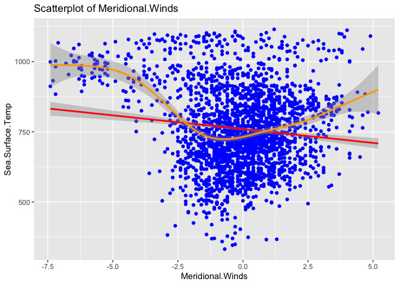

Descriptive Statistics
================
Charlie Zheng
3/3/2020

The “El Nino” data we analyzed in Assignment 1 was measured by 72 buoys distributed in significantly different time periods. The different properties of each buoy would introduce omitted variable bias if we would regress all of them. As a result of this, we chose only one buoy to conduct the regression analysis. We use buoy 2 (3 is the index of buoy 2) for our analysis since it contains the most observations (2298 entries)

``` r
new_elnino <- read.csv("new_elnino.csv")
x <- c()
for (i in 0:71){
  x=c(x,sum(new_elnino$buoy==i))}
which(x==max(x))
```

    ## [1] 3

``` r
buoy2 = new_elnino %>% filter(buoy == 2)
buoy2 <- subset(buoy2,select = -c(diff,buoy))
buoy2 <- na.omit(buoy2)
buoy2$Sea.Surface.Temp <- as.numeric(buoy2$Sea.Surface.Temp)
```

The predictor variables are Zonal.Winds, Meridional Winds, Humidity and Air Temp. Here are the plots and descriptive statistics below. In the box-and-whisker plots, the outliers are plotted as red dots. In the scatterplots, both linear(red) and curvilinear(orange) regression are applied to the plots.

Descriptive statistics of Zonal.Winds:

``` r
getMode <- function(v) {
  uniqv <- unique(v)
  uniqv[which.max(tabulate(match(v, uniqv)))]
}

library(ggplot2)
ggplot(buoy2,aes(y=buoy2$Zonal.Winds)) + 
  geom_boxplot(color="lightblue", notch=TRUE, fill="azure", outlier.color="red", outlier.shape=20,outlier.size=4) +
  ylab("Zonal.Winds") +
  scale_x_discrete() +
  ggtitle("Boxplot of Zonal.Winds")
```


``` r
ggplot(buoy2,aes(x=Zonal.Winds,y=Sea.Surface.Temp)) + 
  geom_point(color = "blue") +
  xlab("Zonal.Winds") +
  ylab("Sea.Surface.Temp") +
  ggtitle("Scatterplot of Zonal.Winds") +
  geom_smooth(method = "lm",color = "red") +
  geom_smooth(color = "orange")
```

    ## `geom_smooth()` using method = 'gam' and formula 'y ~ s(x, bs = "cs")'


``` r
getMode(buoy2$Zonal.Winds)
```

    ## [1] -6.8

``` r
round(stat.desc(buoy2[,5]),2)
```

    ##      nbr.val     nbr.null       nbr.na          min          max 
    ##      2298.00         0.00         0.00        -9.60         5.10 
    ##        range          sum       median         mean      SE.mean 
    ##        14.70    -12491.40        -5.80        -5.44         0.04 
    ## CI.mean.0.95          var      std.dev     coef.var 
    ##         0.09         4.33         2.08        -0.38

Descriptive statistics of Meridional.Winds:

``` r
ggplot(buoy2,aes(y=buoy2$Meridional.Winds)) + 
  geom_boxplot(color="lightblue", notch=TRUE, fill="azure", outlier.color="red", outlier.shape=20,outlier.size=4) +
  ylab("Meridional.Winds") +
  scale_x_discrete() +
  ggtitle("Boxplot of Meridional.Winds")
```


``` r
ggplot(buoy2,aes(x=Meridional.Winds,y=Sea.Surface.Temp)) + 
  geom_point(color = "blue") +
  xlab("Meridional.Winds") +
  ylab("Sea.Surface.Temp") +
  ggtitle("Scatterplot of Meridional.Winds") +
  geom_smooth(method = "lm",color = "red") +
  geom_smooth(color = "orange")
```

    ## `geom_smooth()` using method = 'gam' and formula 'y ~ s(x, bs = "cs")'



``` r
getMode(buoy2$Meridional.Winds)
```

    ## [1] 0.4

``` r
round(stat.desc(buoy2[,6]),2)
```

    ##      nbr.val     nbr.null       nbr.na          min          max 
    ##      2298.00        58.00         0.00        -7.40         5.20 
    ##        range          sum       median         mean      SE.mean 
    ##        12.60      -394.80        -0.10        -0.17         0.04 
    ## CI.mean.0.95          var      std.dev     coef.var 
    ##         0.07         3.28         1.81       -10.54

Descriptive statistics of Humidity:

``` r
ggplot(buoy2,aes(y=buoy2$Humidity)) + 
  geom_boxplot(color="lightblue", notch=TRUE, fill="azure", outlier.color="red", outlier.shape=20,outlier.size=4) +
  ylab("Humidity") +
  scale_x_discrete() +
  ggtitle("Boxplot of Humidity")
```


``` r
ggplot(buoy2,aes(x=Humidity,y=Sea.Surface.Temp)) + 
  geom_point(color = "blue") +
  xlab("Humidity") +
  ylab("Sea.Surface.Temp") +
  ggtitle("Scatterplot of Humidity") +
  geom_smooth(method = "lm",color = "red") +
  geom_smooth(color = "orange")
```

    ## `geom_smooth()` using method = 'gam' and formula 'y ~ s(x, bs = "cs")'


``` r
getMode(buoy2$Humidity)
```

    ## [1] 79.8

``` r
round(stat.desc(buoy2[,7]),2)
```

    ##      nbr.val     nbr.null       nbr.na          min          max 
    ##      2298.00         0.00         0.00        67.80        95.80 
    ##        range          sum       median         mean      SE.mean 
    ##        28.00    187529.10        81.50        81.61         0.08 
    ## CI.mean.0.95          var      std.dev     coef.var 
    ##         0.16        14.48         3.81         0.05

Descriptive statistics of Air.Temp:

``` r
ggplot(buoy2,aes(y=buoy2$Air.Temp)) + 
  geom_boxplot(color="lightblue", notch=TRUE, fill="azure", outlier.color="red", outlier.shape=20,outlier.size=4) +
  ylab("Air.Temp") +
  scale_x_discrete() +
  ggtitle("Boxplot of Humidity")
```


``` r
ggplot(buoy2,aes(x=Air.Temp,y=Sea.Surface.Temp)) + 
  geom_point(color = "blue") +
  xlab("Air.Temp") +
  ylab("Sea.Surface.Temp") +
  ggtitle("Scatterplot of Air.Temp") +
  geom_smooth(method = "lm",color = "red") +
  geom_smooth(color = "orange")
```

    ## `geom_smooth()` using method = 'gam' and formula 'y ~ s(x, bs = "cs")'


``` r
getMode(buoy2$Air.Temp)
```

    ## [1] 25.96

``` r
round(stat.desc(buoy2[,8]),2)
```

    ##      nbr.val     nbr.null       nbr.na          min          max 
    ##      2298.00         0.00         0.00        22.32        29.56 
    ##        range          sum       median         mean      SE.mean 
    ##         7.24     59875.94        26.03        26.06         0.03 
    ## CI.mean.0.95          var      std.dev     coef.var 
    ##         0.05         1.58         1.26         0.05

Descriptive statistics of Sea.Surface.Temp: Because Sea.Surface.Temp is the target variable, a scatterplot cannot be applied to this.

``` r
ggplot(buoy2,aes(y=buoy2$Sea.Surface.Temp)) + 
  geom_boxplot(color="lightblue", notch=TRUE, fill="azure", outlier.color="red", outlier.shape=20,outlier.size=4) +
  ylab("Sea.Surface.Temp") +
  scale_x_discrete() +
  ggtitle("Boxplot of Sea.Surface.")
```


``` r
getMode(buoy2$Sea.Surface.Temp)
```

    ## [1] 713

``` r
round(stat.desc(buoy2[,9]),2)
```

    ##      nbr.val     nbr.null       nbr.na          min          max 
    ##      2298.00         0.00         0.00       332.00      1115.00 
    ##        range          sum       median         mean      SE.mean 
    ##       783.00   1748995.00       746.00       761.09         3.06 
    ## CI.mean.0.95          var      std.dev     coef.var 
    ##         6.01     21557.46       146.82         0.19
