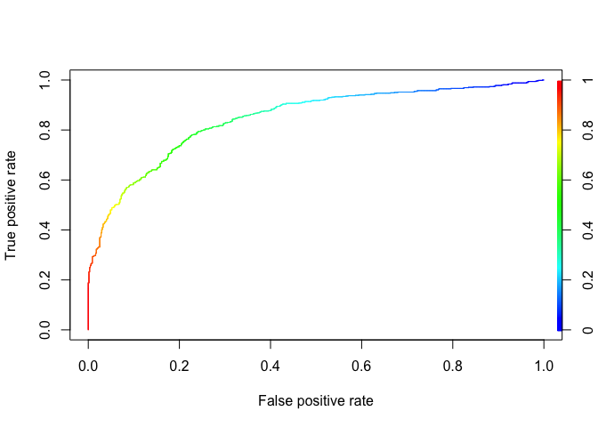

Logistic Regression
================
Charlie Zheng
3/9/2020

``` r
#get buoy 2 and 48
new_elnino <- read.csv("new_elnino.csv")
buoy2 <- new_elnino %>% filter(buoy==2)
buoy48 <- new_elnino %>% filter((buoy==48))
buoy248 <- rbind(buoy2,buoy48)
#choose only the selected variables
buoy248 <- buoy248 %>% select(Zonal.Winds,Meridional.Winds,Humidity,Air.Temp,Sea.Surface.Temp,buoy)
#change buoy2 as 1 and buoy 48 as 0
buoy248$buoy[buoy248$buoy==2] <- 1
buoy248$buoy[buoy248$buoy==48] <- 0
buoy248$Sea.Surface.Temp <- as.double(buoy248$Sea.Surface.Temp)
```

``` r
#get training and testing data
set.seed(9)
trainindex <- sample(c(dim(buoy248)[1]),dim(buoy248)[1]*0.7)
train <- buoy248[trainindex,]
valid <- buoy248[-trainindex,]
```

``` r
#logistic regression
logit2 <- glm(buoy~Sea.Surface.Temp+Meridional.Winds+Zonal.Winds:Humidity+Zonal.Winds:Air.Temp+Meridional.Winds:Humidity+Meridional.Winds:Air.Temp+Humidity:Air.Temp,data = train,family = binomial(link = "logit"))
options(scipen=999)
summary(logit2)
```

    ## 
    ## Call:
    ## glm(formula = buoy ~ Sea.Surface.Temp + Meridional.Winds + Zonal.Winds:Humidity + 
    ##     Zonal.Winds:Air.Temp + Meridional.Winds:Humidity + Meridional.Winds:Air.Temp + 
    ##     Humidity:Air.Temp, family = binomial(link = "logit"), data = train)
    ## 
    ## Deviance Residuals: 
    ##      Min        1Q    Median        3Q       Max  
    ## -2.71396  -0.76595   0.08735   0.72296   3.01477  
    ## 
    ## Coefficients:
    ##                             Estimate Std. Error z value
    ## (Intercept)               16.0516517  1.0849827  14.794
    ## Sea.Surface.Temp          -0.0032199  0.0009706  -3.318
    ## Meridional.Winds          10.2932899  1.0486301   9.816
    ## Zonal.Winds:Humidity      -0.0388785  0.0033862 -11.482
    ## Zonal.Winds:Air.Temp       0.1286113  0.0097684  13.166
    ## Meridional.Winds:Humidity -0.0322262  0.0071631  -4.499
    ## Meridional.Winds:Air.Temp -0.2726314  0.0304589  -8.951
    ## Humidity:Air.Temp         -0.0053468  0.0007112  -7.518
    ##                                       Pr(>|z|)    
    ## (Intercept)               < 0.0000000000000002 ***
    ## Sea.Surface.Temp                      0.000908 ***
    ## Meridional.Winds          < 0.0000000000000002 ***
    ## Zonal.Winds:Humidity      < 0.0000000000000002 ***
    ## Zonal.Winds:Air.Temp      < 0.0000000000000002 ***
    ## Meridional.Winds:Humidity   0.0000068294426053 ***
    ## Meridional.Winds:Air.Temp < 0.0000000000000002 ***
    ## Humidity:Air.Temp           0.0000000000000555 ***
    ## ---
    ## Signif. codes:  0 '***' 0.001 '**' 0.01 '*' 0.05 '.' 0.1 ' ' 1
    ## 
    ## (Dispersion parameter for binomial family taken to be 1)
    ## 
    ##     Null deviance: 4402.1  on 3175  degrees of freedom
    ## Residual deviance: 2935.4  on 3168  degrees of freedom
    ## AIC: 2951.4
    ## 
    ## Number of Fisher Scoring iterations: 5

``` r
#prediction
logit2pred <- predict(logit2, valid[,-6], type = "response")
predict <- ifelse(logit2pred> 0.5, "1", "0")
data.frame(actual = valid$buoy[100:110],predicted = predict[100:110])
```

    ##     actual predicted
    ## 308      1         0
    ## 314      1         1
    ## 321      1         1
    ## 322      1         0
    ## 324      1         1
    ## 325      1         1
    ## 327      1         1
    ## 332      1         1
    ## 335      1         1
    ## 338      1         1
    ## 339      1         1

``` r
confusionMatrix(as.factor(predict), as.factor(valid$buoy))
```

    ## Confusion Matrix and Statistics
    ## 
    ##           Reference
    ## Prediction   0   1
    ##          0 545 184
    ##          1 132 501
    ##                                                
    ##                Accuracy : 0.768                
    ##                  95% CI : (0.7446, 0.7902)     
    ##     No Information Rate : 0.5029               
    ##     P-Value [Acc > NIR] : < 0.00000000000000022
    ##                                                
    ##                   Kappa : 0.5362               
    ##                                                
    ##  Mcnemar's Test P-Value : 0.004118             
    ##                                                
    ##             Sensitivity : 0.8050               
    ##             Specificity : 0.7314               
    ##          Pos Pred Value : 0.7476               
    ##          Neg Pred Value : 0.7915               
    ##              Prevalence : 0.4971               
    ##          Detection Rate : 0.4001               
    ##    Detection Prevalence : 0.5352               
    ##       Balanced Accuracy : 0.7682               
    ##                                                
    ##        'Positive' Class : 0                    
    ## 

``` r
#ROC
ROCRpred <- prediction(logit2pred, valid$buoy)
ROCRperf <- performance(ROCRpred, 'tpr','fpr')
plot(ROCRperf, colorize = TRUE, text.adj = c(-0.2,1.7))
```


